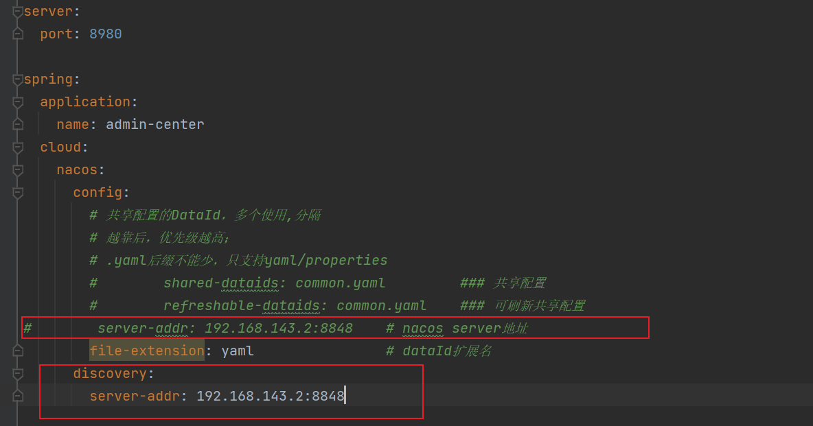
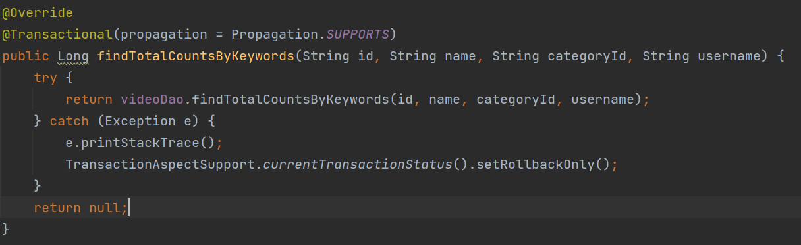

项目搭建步骤   

搭建好微服务模块后，就弄nacos，讲服务注册进nacos   

注意服务被注册的配置文件 bootstrap.yaml 里面是用的discovery:server-addr 而不是 config:server-addr   

我们服务是用nacos作为注册中心，那就是discovery  ，如果是作为配置中心那就用config开头的   
      

处理完工作的微服务之后我们处理网关微服务   
首先网关微服务也是需要注册到nacos的   
网关微服务和其他微服务不一样的地方在于他只需要用nacos的依赖   

# 如果用了事务，出现异常时要手动回滚  
TransactionAspectSupport.currentTransactionStatus().setRollbackOnly();   
   

# 报错的时候区分是网关的错还是其他微服务的错  
如果你发请求的时候，网关微服务的控制台什么都没有，那说明服务连断言都没进，说明是网关的问题   

# ES 部署错误：  vm给es 的内存太小了  
<https://blog.csdn.net/symuamua/article/details/104346501?spm=1001.2101.3001.6661.1&utm_medium=distribute.pc_relevant_t0.none-task-blog-2%7Edefault%7ECTRLIST%7ERate-1-104346501-blog-116380039.pc_relevant_default&depth_1-utm_source=distribute.pc_relevant_t0.none-task-blog-2%7Edefault%7ECTRLIST%7ERate-1-104346501-blog-116380039.pc_relevant_default&utm_relevant_index=1>        

