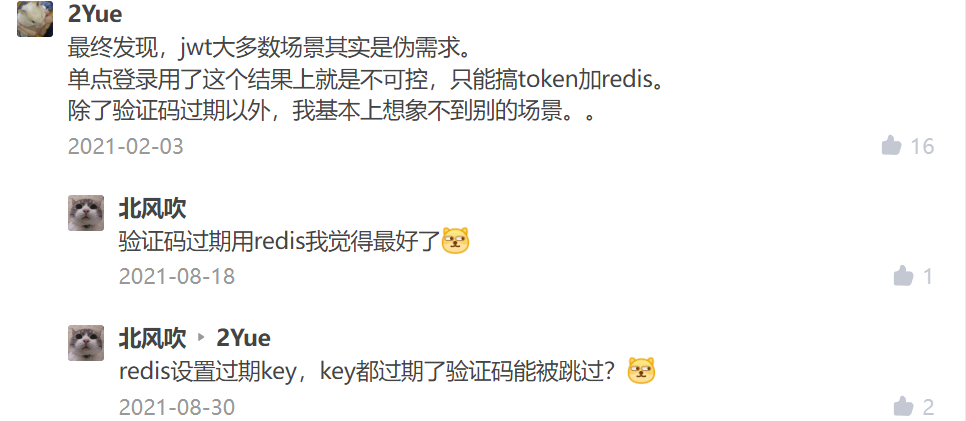
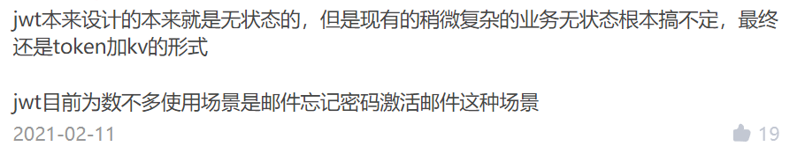
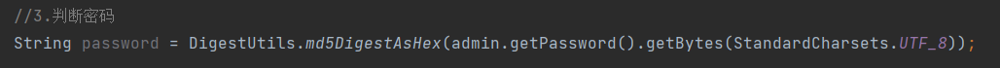
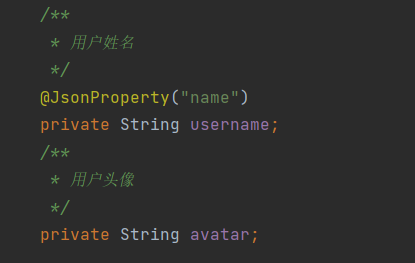
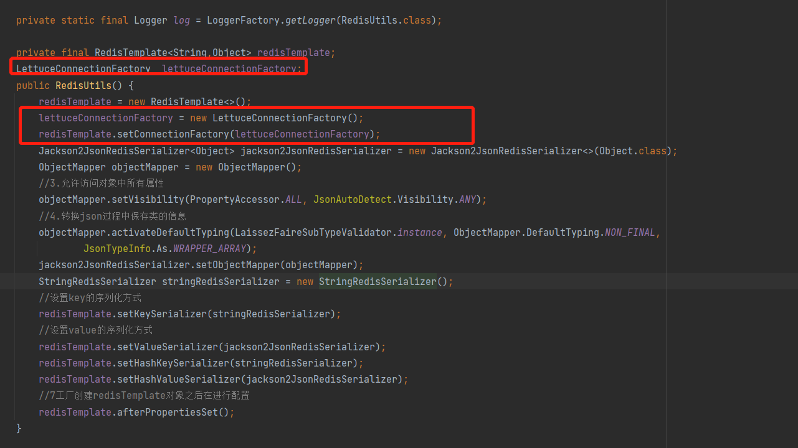
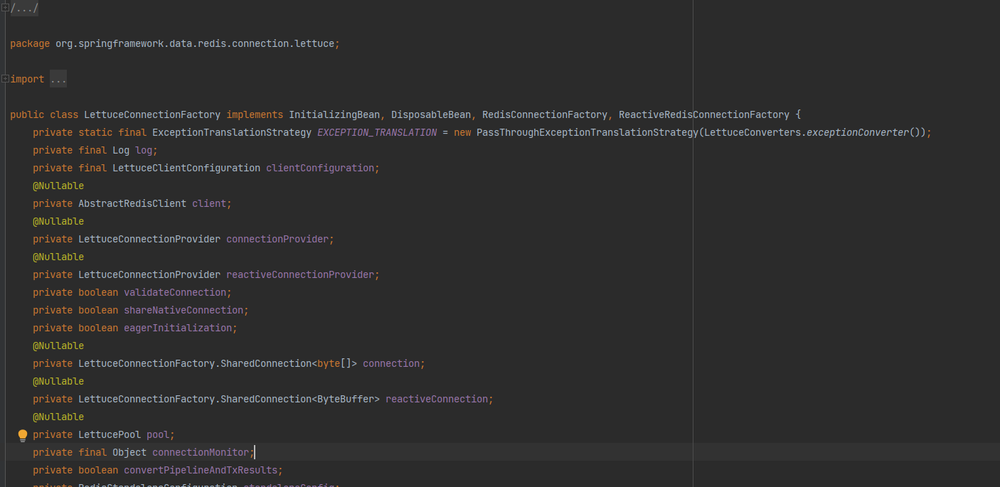

# 1 登录 
步骤:  
* 1 拿到用户名和密码
* 2 通过spring的DigestUtils将密码转换成md5加密后的密码，到数据库查询   
* 3 如果有的话，则返回的是adminDB，即数据库中完整的真实用户信息，然后拿出来
从controller中获取到用户登录请求携带的token   


用session值作为Token

客户端：客户端只需携带用户名和密码登陆即可。

服务端：服务端接收到用户名和密码后并判断，如果正确了就将本地获取sessionID作为Token返回给客户端，客户端以后只需带上请求数据即可。

分析：这种方式使用的好处是方便，不用存储数据，但是缺点就是当session过期后，客户端必须重新登录才能进行访问数据


拿到token后存储到redis中，设置过期时间    

JWT和token(sessionId+redis)哪种方案更好用     
<https://www.zhihu.com/question/274566992?sort=created>

答案是：项目没有不用redis的，有了redis，还有你jwt啥事儿    

     

    
        

* 4 如果失败（密码不匹配），那就抛出运行时异常


Spring的加密工具类---DigestUtils    

   


Hash算法
Hash算法特别的地方在于它是一种单向算法，用户可以通过Hash算法对目标信息生成一段特定长度的唯一的Hash值，却不能通过这个Hash值重新获得目标信息。因此Hash算法常用在不可还原的密码存储、信息完整性校验等。

常见的Hash算法：MD2、MD4、MD5、HAVAL、SHA、SHA-1、HMAC、HMAC-MD5、HMAC-SHA1

加密算法的效能通常可以按照算法本身的复杂程度、密钥长度（密钥越长越安全）、加解密速度等来衡量。上述的算法中，除了DES密钥长度不够、MD2速度较慢已逐渐被淘汰外，其他算法仍在目前的加密系统产品中使用。


常用于对数据库进行密码加密的加密算法有以下几种    
1.MD5加密算法

MD5为计算机安全领域广泛使用的一种散列函数，用以提供消息的完整性保护，MD5是以512位分组来处理输入的信息，且每一分组又被划分为16个32位子分组，经过了一系列的处理后，算法的输出由四个32位分组组成，将这四个32位分组级联后将生成—个128位散列值。

2.DES加密算法

DES加密算法是一种分组密码，以64位为分组对数据加密，它的密钥长度是56位，加密解密用同一算法。DES加密算法是对密钥进行保密，而公开算法，包括加密和解密算法。

3.RSA加密算法

RSA算法是一种使用不同的加密密钥与解密密钥，是由已知加密密钥推导出解密密钥在计算上是不可行的密码体制，其原理是根据数论，寻求两个大素数比较简单，而将它们的乘积进行因式分解却极其困难，因此可以将乘积公开作为加密密钥。   


### 减少json大小，提高网络速度   

有些接口只要这部分的json数据，就不要把其他的属性返回了，会降低网络速度   

前后端分离的情况下， 我们可以用一个对象来接收，这个对象叫作data transfer object，放在dto包下   
日后这个对象要在前后端之间进行数据传输


   

AdminMsg就是Admin的网络传输对象  
    
只有Admin里面的两个属性   

我们从redis查询出来的admin对象，可以用Spring的BeanUtils来进行属性复制,一样名字的属性就能自动复制过去     

@JsonProperty  
转换到Json里面的格式名    


# 报错记录  
org.springframework.beans.factory.BeanCreationException: Error creating bean with name 'adminController' defined in file [E:\java\TV-Microservice-admin\admin-center\target\classes\com\syf\admin\controller\AdminController.class]: Bean instantiation via constructor failed; nested exception is org.springframework.beans.BeanInstantiationException: Failed to instantiate [com.syf.admin.controller.AdminController]: Constructor threw exception; nested exception is org.springframework.beans.factory.BeanCreationException: Error creating bean with name 'redisUtils' defined in com.syf.redis.config.RedisAutoConfig: Bean instantiation via factory method failed; nested exception is org.springframework.beans.BeanInstantiationException: Failed to instantiate [com.syf.redis.util.RedisUtils]: Factory method 'redisUtils' threw exception; nested exception is java.lang.IllegalStateException: RedisConnectionFactory is required
at org.springframework.beans.factory.support.ConstructorResolver.instantiate(ConstructorResolver.java:314) ~[spring-beans-5.2.4.RELEASE.jar:5.2.4.RELEASE]
at org.springframework.beans.factory.support.ConstructorResolver.autowireConstructor(ConstructorResolver.java:295) ~[spring-beans-5.2.4.RELEASE.jar:5.2.4.RELEASE]
at org.springframework.beans.factory.support.AbstractAutowireCapableBeanFactory.autowireConstructor(AbstractAutowireCapableBeanFactory.java:1358) ~[spring-beans-5.2.4.RELEASE.jar:5.2.4.RELEASE]
at org.springframework.beans.factory.support.AbstractAutowireCapableBeanFactory.createBeanInstance(AbstractAutowireCapableBeanFactory.java:1204) ~[spring-beans-5.2.4.RELEASE.jar:5.2.4.RELEASE]
at org.springframework.beans.factory.support.AbstractAutowireCapableBeanFactory.doCreateBean(AbstractAutowireCapableBeanFactory.java:557) ~[spring-beans-5.2.4.RELEASE.jar:5.2.4.RELEASE]
at org.springframework.beans.factory.support.AbstractAutowireCapableBeanFactory.createBean(AbstractAutowireCapableBeanFactory.java:517) ~[spring-beans-5.2.4.RELEASE.jar:5.2.4.RELEASE]
at org.springframework.beans.factory.support.AbstractBeanFactory.lambda$doGetBean$0(AbstractBeanFactory.java:323) ~[spring-beans-5.2.4.RELEASE.jar:5.2.4.RELEASE]
at org.springframework.beans.factory.support.DefaultSingletonBeanRegistry.getSingleton(DefaultSingletonBeanRegistry.java:222) ~[spring-beans-5.2.4.RELEASE.jar:5.2.4.RELEASE]
at org.springframework.beans.factory.support.AbstractBeanFactory.doGetBean(AbstractBeanFactory.java:321) ~[spring-beans-5.2.4.RELEASE.jar:5.2.4.RELEASE]
at org.springframework.beans.factory.support.AbstractBeanFactory.getBean(AbstractBeanFactory.java:202) ~[spring-beans-5.2.4.RELEASE.jar:5.2.4.RELEASE]
at org.springframework.beans.factory.support.DefaultListableBeanFactory.preInstantiateSingletons(DefaultListableBeanFactory.java:879) ~[spring-beans-5.2.4.RELEASE.jar:5.2.4.RELEASE]
at org.springframework.context.support.AbstractApplicationContext.finishBeanFactoryInitialization(AbstractApplicationContext.java:878) ~[spring-context-5.2.4.RELEASE.jar:5.2.4.RELEASE]
at org.springframework.context.support.AbstractApplicationContext.refresh(AbstractApplicationContext.java:550) ~[spring-context-5.2.4.RELEASE.jar:5.2.4.RELEASE]
at org.springframework.boot.web.servlet.context.ServletWebServerApplicationContext.refresh(ServletWebServerApplicationContext.java:141) ~[spring-boot-2.2.5.RELEASE.jar:2.2.5.RELEASE]
at org.springframework.boot.SpringApplication.refresh(SpringApplication.java:747) [spring-boot-2.2.5.RELEASE.jar:2.2.5.RELEASE]
at org.springframework.boot.SpringApplication.refreshContext(SpringApplication.java:397) [spring-boot-2.2.5.RELEASE.jar:2.2.5.RELEASE]
at org.springframework.boot.SpringApplication.run(SpringApplication.java:315) [spring-boot-2.2.5.RELEASE.jar:2.2.5.RELEASE]
at org.springframework.boot.SpringApplication.run(SpringApplication.java:1226) [spring-boot-2.2.5.RELEASE.jar:2.2.5.RELEASE]
at org.springframework.boot.SpringApplication.run(SpringApplication.java:1215) [spring-boot-2.2.5.RELEASE.jar:2.2.5.RELEASE]
at com.syf.admin.AdminCenterApplication.main(AdminCenterApplication.java:11) [classes/:na]
Caused by: org.springframework.beans.BeanInstantiationException: Failed to instantiate [com.syf.admin.controller.AdminController]: Constructor threw exception; nested exception is org.springframework.beans.factory.BeanCreationException: Error creating bean with name 'redisUtils' defined in com.syf.redis.config.RedisAutoConfig: Bean instantiation via factory method failed; nested exception is org.springframework.beans.BeanInstantiationException: Failed to instantiate [com.syf.redis.util.RedisUtils]: Factory method 'redisUtils' threw exception; nested exception is java.lang.IllegalStateException: RedisConnectionFactory is required
at org.springframework.beans.BeanUtils.instantiateClass(BeanUtils.java:216) ~[spring-beans-5.2.4.RELEASE.jar:5.2.4.RELEASE]
at org.springframework.beans.factory.support.SimpleInstantiationStrategy.instantiate(SimpleInstantiationStrategy.java:117) ~[spring-beans-5.2.4.RELEASE.jar:5.2.4.RELEASE]
at org.springframework.beans.factory.support.ConstructorResolver.instantiate(ConstructorResolver.java:310) ~[spring-beans-5.2.4.RELEASE.jar:5.2.4.RELEASE]
... 19 common frames omitted
Caused by: org.springframework.beans.factory.BeanCreationException: Error creating bean with name 'redisUtils' defined in com.syf.redis.config.RedisAutoConfig: Bean instantiation via factory method failed; nested exception is org.springframework.beans.BeanInstantiationException: Failed to instantiate [com.syf.redis.util.RedisUtils]: Factory method 'redisUtils' threw exception; nested exception is java.lang.IllegalStateException: RedisConnectionFactory is required
at org.springframework.beans.factory.support.ConstructorResolver.instantiate(ConstructorResolver.java:656) ~[spring-beans-5.2.4.RELEASE.jar:5.2.4.RELEASE]
at org.springframework.beans.factory.support.ConstructorResolver.instantiateUsingFactoryMethod(ConstructorResolver.java:484) ~[spring-beans-5.2.4.RELEASE.jar:5.2.4.RELEASE]
at org.springframework.beans.factory.support.AbstractAutowireCapableBeanFactory.instantiateUsingFactoryMethod(AbstractAutowireCapableBeanFactory.java:1338) ~[spring-beans-5.2.4.RELEASE.jar:5.2.4.RELEASE]
at org.springframework.beans.factory.support.AbstractAutowireCapableBeanFactory.createBeanInstance(AbstractAutowireCapableBeanFactory.java:1177) ~[spring-beans-5.2.4.RELEASE.jar:5.2.4.RELEASE]
at org.springframework.beans.factory.support.AbstractAutowireCapableBeanFactory.doCreateBean(AbstractAutowireCapableBeanFactory.java:557) ~[spring-beans-5.2.4.RELEASE.jar:5.2.4.RELEASE]
at org.springframework.beans.factory.support.AbstractAutowireCapableBeanFactory.createBean(AbstractAutowireCapableBeanFactory.java:517) ~[spring-beans-5.2.4.RELEASE.jar:5.2.4.RELEASE]
at org.springframework.beans.factory.support.AbstractBeanFactory.lambda$doGetBean$0(AbstractBeanFactory.java:323) ~[spring-beans-5.2.4.RELEASE.jar:5.2.4.RELEASE]
at org.springframework.beans.factory.support.DefaultSingletonBeanRegistry.getSingleton(DefaultSingletonBeanRegistry.java:222) ~[spring-beans-5.2.4.RELEASE.jar:5.2.4.RELEASE]
at org.springframework.beans.factory.support.AbstractBeanFactory.doGetBean(AbstractBeanFactory.java:321) ~[spring-beans-5.2.4.RELEASE.jar:5.2.4.RELEASE]
at org.springframework.beans.factory.support.AbstractBeanFactory.getBean(AbstractBeanFactory.java:202) ~[spring-beans-5.2.4.RELEASE.jar:5.2.4.RELEASE]
at org.springframework.beans.factory.support.DefaultListableBeanFactory.preInstantiateSingletons(DefaultListableBeanFactory.java:879) ~[spring-beans-5.2.4.RELEASE.jar:5.2.4.RELEASE]
at org.springframework.context.support.AbstractApplicationContext.finishBeanFactoryInitialization(AbstractApplicationContext.java:878) ~[spring-context-5.2.4.RELEASE.jar:5.2.4.RELEASE]
at org.springframework.context.support.AbstractApplicationContext.refresh(AbstractApplicationContext.java:550) ~[spring-context-5.2.4.RELEASE.jar:5.2.4.RELEASE]
at org.springframework.context.annotation.AnnotationConfigApplicationContext.<init>(AnnotationConfigApplicationContext.java:89) ~[spring-context-5.2.4.RELEASE.jar:5.2.4.RELEASE]
at com.syf.admin.controller.AdminController.<init>(AdminController.java:38) ~[classes/:na]
at sun.reflect.NativeConstructorAccessorImpl.newInstance0(Native Method) ~[na:1.8.0_322]
at sun.reflect.NativeConstructorAccessorImpl.newInstance(NativeConstructorAccessorImpl.java:62) ~[na:1.8.0_322]
at sun.reflect.DelegatingConstructorAccessorImpl.newInstance(DelegatingConstructorAccessorImpl.java:45) ~[na:1.8.0_322]
at java.lang.reflect.Constructor.newInstance(Constructor.java:423) ~[na:1.8.0_322]
at org.springframework.beans.BeanUtils.instantiateClass(BeanUtils.java:203) ~[spring-beans-5.2.4.RELEASE.jar:5.2.4.RELEASE]
... 21 common frames omitted
Caused by: org.springframework.beans.BeanInstantiationException: Failed to instantiate [com.syf.redis.util.RedisUtils]: Factory method 'redisUtils' threw exception; nested exception is java.lang.IllegalStateException: RedisConnectionFactory is required
at org.springframework.beans.factory.support.SimpleInstantiationStrategy.instantiate(SimpleInstantiationStrategy.java:185) ~[spring-beans-5.2.4.RELEASE.jar:5.2.4.RELEASE]
at org.springframework.beans.factory.support.ConstructorResolver.instantiate(ConstructorResolver.java:651) ~[spring-beans-5.2.4.RELEASE.jar:5.2.4.RELEASE]
... 40 common frames omitted
Caused by: java.lang.IllegalStateException: RedisConnectionFactory is required
at org.springframework.util.Assert.state(Assert.java:73) ~[spring-core-5.2.4.RELEASE.jar:5.2.4.RELEASE]
at org.springframework.data.redis.core.RedisAccessor.afterPropertiesSet(RedisAccessor.java:38) ~[spring-data-redis-2.2.5.RELEASE.jar:2.2.5.RELEASE]
at org.springframework.data.redis.core.RedisTemplate.afterPropertiesSet(RedisTemplate.java:127) ~[spring-data-redis-2.2.5.RELEASE.jar:2.2.5.RELEASE]
at com.syf.redis.util.RedisUtils.<init>(RedisUtils.java:55) ~[classes/:na]
at com.syf.redis.config.RedisAutoConfig.redisUtils(RedisAutoConfig.java:26) ~[classes/:na]
at com.syf.redis.config.RedisAutoConfig$$EnhancerBySpringCGLIB$$214fbc27.CGLIB$redisUtils$0(<generated>) ~[classes/:na]
at com.syf.redis.config.RedisAutoConfig$$EnhancerBySpringCGLIB$$214fbc27$$FastClassBySpringCGLIB$$9d705102.invoke(<generated>) ~[classes/:na]
at org.springframework.cglib.proxy.MethodProxy.invokeSuper(MethodProxy.java:244) ~[spring-core-5.2.4.RELEASE.jar:5.2.4.RELEASE]
at org.springframework.context.annotation.ConfigurationClassEnhancer$BeanMethodInterceptor.intercept(ConfigurationClassEnhancer.java:331) ~[spring-context-5.2.4.RELEASE.jar:5.2.4.RELEASE]
at com.syf.redis.config.RedisAutoConfig$$EnhancerBySpringCGLIB$$214fbc27.redisUtils(<generated>) ~[classes/:na]
at sun.reflect.NativeMethodAccessorImpl.invoke0(Native Method) ~[na:1.8.0_322]
at sun.reflect.NativeMethodAccessorImpl.invoke(NativeMethodAccessorImpl.java:62) ~[na:1.8.0_322]
at sun.reflect.DelegatingMethodAccessorImpl.invoke(DelegatingMethodAccessorImpl.java:43) ~[na:1.8.0_322]
at java.lang.reflect.Method.invoke(Method.java:498) ~[na:1.8.0_322]
at org.springframework.beans.factory.support.SimpleInstantiationStrategy.instantiate(SimpleInstantiationStrategy.java:154) ~[spring-beans-5.2.4.RELEASE.jar:5.2.4.RELEASE]
... 41 common frames omitted      


```
Caused by: java.lang.IllegalStateException: RedisConnectionFactory is required  
```


错误1：  RedisConnectionFactory is required   

自定义redisTemplate组成方法，必须设置连接方式   

   

这个LettuceConnectionFactory实现了RedisConnectionFactory   
   
