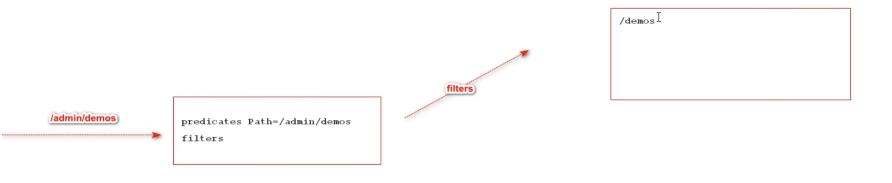

gateway 的路由 由断言和过滤组成     


    


# 前端跨域问题  


```yaml
      globalcors: # 跨域配置处理
        cors-configurations:
          '[/**]':
            allowedOrigins: "*"
            allowedMethods: "*"
            allowedHeaders: "*"
```  


# 自定义Token局部过滤器  TokenGatewayFilterFactory   
代码看    
package com.syf.gateway.filter.factory.TokenGatewayFilterFactory;        


模仿GatewayFilterFactory的其他实现类的源码     


# 网关异常处理   webflux编程   


首先响应的异常一定是json格式的   


然后是响应状态码的选择   

HttpStatus枚举类，里面有所有的状态码    
